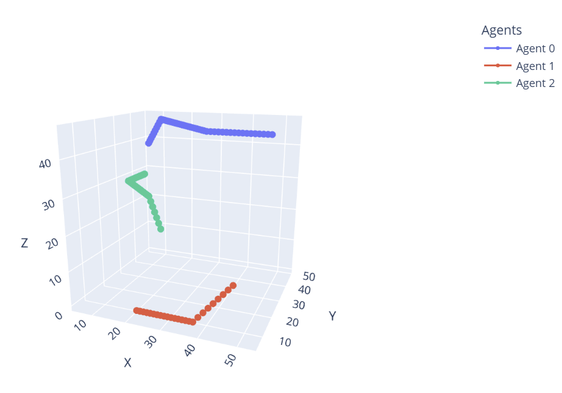

# Cooperative A* for Multi-Agent 3D Pathfinding

This repository contains a **Python implementation of Cooperative A*** for multi-agent pathfinding in a **3D environment**. The algorithm extends A* to handle **multiple agents** by considering obstacle avoidance in both **spatial and temporal dimensions**.

## 📷 Example Visualization


## ✨ Features
- **3D Multi-Agent Path Planning** 🛩️
- **Obstacle Avoidance with Volume Constraints** 🏔️
- **Scalable to Multiple Agents** 🤖🤖
- **Supports CSV Output for Analysis** 📊

---

## 🔧 Installation
### 1️⃣ Clone the repository
```bash
git clone https://github.com/your-username/cooperative-a-star-3d.git
cd cooperative-a-star-3d
pip install -r requirements.txt
